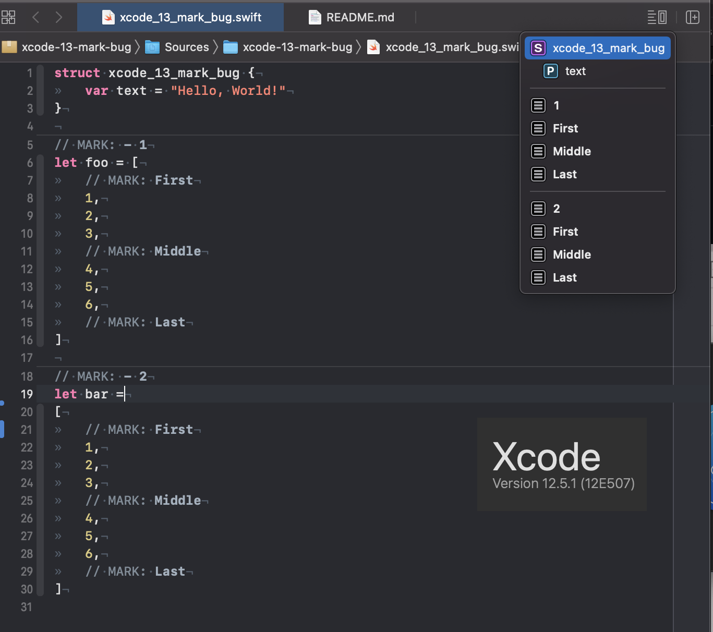
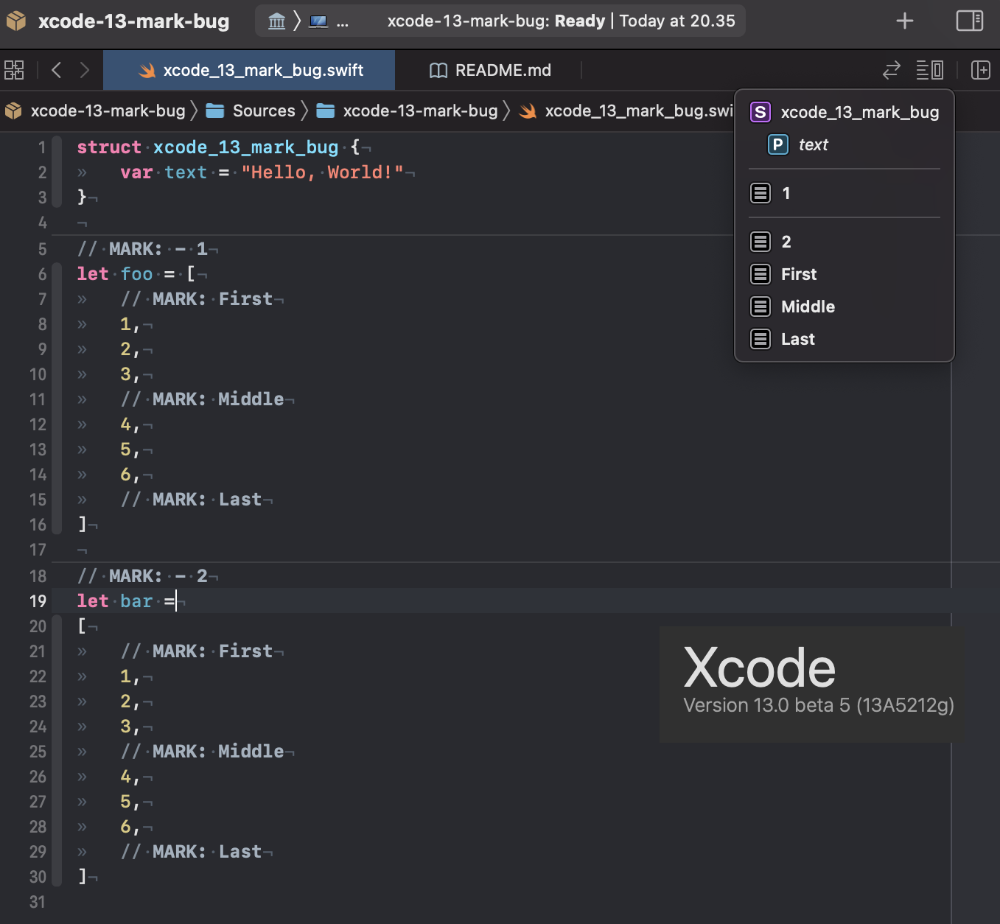
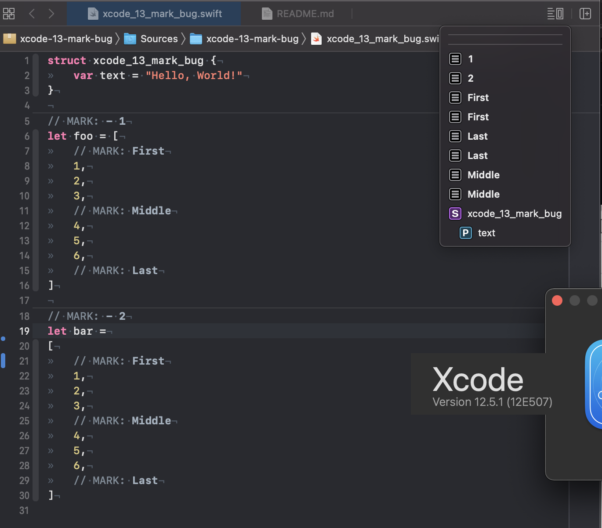
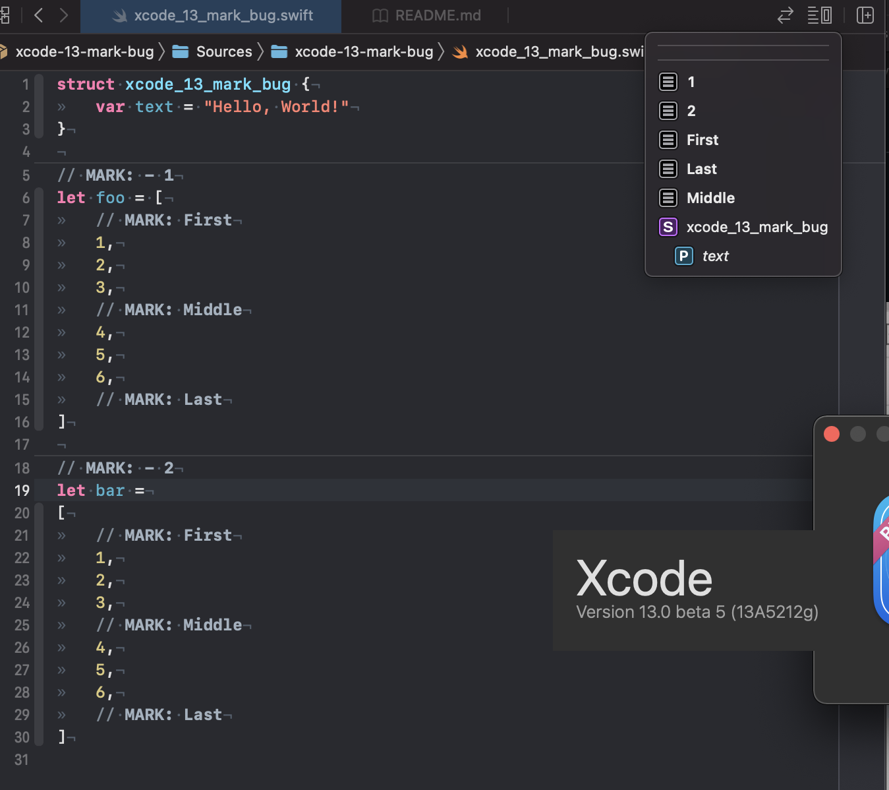

# xcode-13-mark-bug

This repo exists only to show an Xcode bug with minimal code

## Primary bug (introduced in Xcode 13 betas)

Here, the view is in focus. The code in question is
```swift
// MARK: - 1
let foo = [
	// MARK: First
	1,
	2,
	3,
	// MARK: Middle
	4,
	5,
	6,
	// MARK: Last
]

// MARK: - 2
let bar =
[
	// MARK: First
	1,
	2,
	3,
	// MARK: Middle
	4,
	5,
	6,
	// MARK: Last
]
```

In Xcode 12, all marks are shown for both the 1st group and the 2nd group.

In Xcode 13, the marks inside the 1st array are not shown. The marks in the 2nd array is shown, so apparently Xcode behaves differently if the array starts on a different line.

### Xcode 12


### Xcode 13



## Secondary bug (bonus, is reproducible in Xcode 12 as well)

This was discovered as I was taking the screenshots. It is the same code as above, but I used ⌘-click to open the navigation widget while the About window was in focus.

The list contains the same items as in the bug above for both versions (so the first bug is still present in Xcode 13), but the order is different. Normally, items are ordered by their line number, but when not in focus, they are ordered alphabetically. This means that line-separators are all ordered in the top.

### Xcode 12


### Xcode 13

